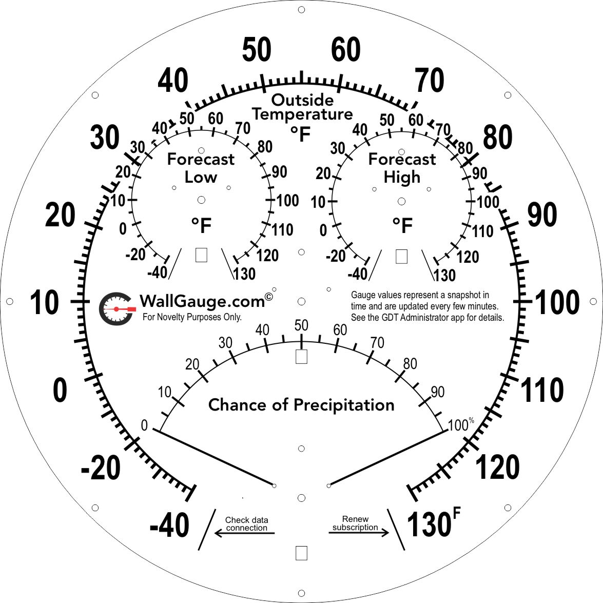

# Tempest Weather WallGauge

This WallGauge displays weather data from your home Tempest weather station.  The data is pulled from the WeatherFlow API (that is where your Tempest uploads its weather data)

## Deeper Dive

The Tempest Weather WallGauge is a collection of four gauges on one gauge face.  Each gauge has a unique data source and are all sourced from the [WeatherFlow Smart Weather API](https://weatherflow.github.io/SmartWeather/api/#object-model).  I have created a node.js data delegate called the [weatherFlowDataGetter](https://github.com/WallGauge-GaugeApps/weatherFlowDataGetter/blob/master/README.md) that makes the API calls and returns the data to this gauge app. The weather Flow Data Getter and this gauge app are open source library’s and you're welcome to improve or use these library’s in your own projects.

### Gauge Walk-Through

- Outside ring (main gauge). The main gauge shows the current outside temperature observed at your Tempest.  The values on this gauge are in degrees Fahrenheit.
- Forecast Low Temperature (upper left gauge). This gauge shows the forecast low temperature for the day in degrees Fahrenheit.
- Forecast High Temperature (upper right gauge). This gauge shows the forecast high temperature for the day in degrees Fahrenheit.
- Chance of Precipitation (bottom center gauge). This gauge has a range from 0 to 100 percent.  It shows the likelihood of precipitation for the day.

### Error indicators

All WallGauges require a [WallGauge.com Gauge Data Transmitter](https://www.wallgauge.com/) (GDT) to run their gauge app. The GDT gives a gauge app a platform for getting gauge data from the Internet and beaming it (with infrared LEDs) to the WallGauge.  

At the bottom of the main gauge you will find two error indicators labeled “Check data connection” and “Renew subscription”.

- Check data connection. If the GDT is powered off or cannot connect to the data source it will stop sending infrared data to this gauge.  If the gauge does not receive data for 20 minutes it will move the needle to the Check data connection position.  This lets the user know something is wrong with the GDT or the data connection.   Check your wireless network connection and make sure your GDT has access to the Internet.
- Renew subscription. Each GDT requires a support subscription if this subscription has not been renewed, the GDT will move the needle to the Renew subscription position and stop displaying the gauge value.  Renew this GDT’s subscription or move the gauge to a GDT that has an active subscription and install this gauge app.

## Data Source

The data for this gauge are from the [WeatherFlow Smart Weather API](https://weatherflow.github.io/SmartWeather/api/#object-model). You must have a Tempest weather station and create a [WeatherFlow Personal Use Token](https://tempestwx.com/settings/tokens) to access your station’s cloud data with this WallGauge.  The [Smart Weather API Remote Data Access Policy](https://weatherflow.github.io/SmartWeather/api/remote-developer-policy.html) gives an overview of the access required for a station owner to access their own data.  

See [How to get a tempest personal use token](docs/getTokenInstructions.md)

## Security

This gauge requires a WeatherFlow Personal Use Token (API Key) to access your Tempest cloud data.  The WeatherFlow Personal Use Token is encrypted and stored on your GDT.  We do not keep a copy of it in the cloud.  It is only used to access your Tempest weather data.  However, if your GDT is physically stolen or compromised your WeatherFlow Personal Use Token may be accessible.  To revoke a Personal Use Token, connect to the [TempestWx.com web site](https://tempestwx.com/settings/tokens) and delete it.  You can create a new one at any time.

## Gauge Pictures

